# github-compliance-engine

## Overview

GitHub Compliance Engine is a POC for analyzing public GitHub repositories and producing a Golden Thread traceability report. The system accepts a public repository URL, runs a Python analysis pipeline, builds a lexical graph in Neo4j, maps externally-facing interfaces to inferred business objectives, flags orphaned code paths, and returns a reviewable alignment score and report.


## Architecture

```mermaid
flowchart LR
  user[End User] --> frontend[Next.js Frontend]
  frontend -->|"POST /api/analyze"| backend[Python Analysis Backend]
  frontend -->|"GET /api/analyze/:id/results"| backend

  backend --> ingestion[Repo Ingestion]
  ingestion --> parser[Rule-set Parser]
  parser --> graphBuilder[Graph Builder]
  graphBuilder --> neo4j[(Neo4j Graph Store)]

  neo4j --> objective[Objective Mapping]
  objective --> orphan[Orphan Detection]
  orphan --> score[Traceability Scoring]
  score --> report[Golden Thread Report]
  report --> frontend
```



## Docker

This repository uses Docker Compose to orchestrate the local POC stack:

- `frontend`: Next.js app on `http://localhost:3000`
- `backend`: Python analysis API on `http://localhost:8000`
- `neo4j`: Neo4j browser on `http://localhost:7474` and Bolt on `bolt://localhost:7687`

### Configure local environment

Create a local `.env` from the safe example values:

```sh
cp .env.example .env
```

The example file uses local-only placeholders:

```sh
NEXT_PUBLIC_BACKEND_BASE_URL=http://localhost:8000
FRONTEND_HOSTNAME=0.0.0.0
FRONTEND_PORT=3000
BACKEND_HOST=0.0.0.0
BACKEND_PORT=8000
BACKEND_CORS_ORIGINS=http://localhost:3000
NEO4J_URI=bolt://neo4j:7687
NEO4J_USER=neo4j
NEO4J_PASSWORD=local-dev-password
NEO4J_HTTP_PORT=7474
NEO4J_BOLT_PORT=7687
```

Do not commit `.env`; it is ignored by git.

`NEO4J_PASSWORD` is required by Compose and the backend runtime. The placeholder belongs only in `.env.example`; set a local value in `.env` before running Docker commands.

For one-off Docker commands, export the full local configuration in the same terminal before building or starting services:

```sh
export NEXT_PUBLIC_BACKEND_BASE_URL=http://localhost:8000
export FRONTEND_HOSTNAME=0.0.0.0
export FRONTEND_PORT=3000
export BACKEND_HOST=0.0.0.0
export BACKEND_PORT=8000
export BACKEND_CORS_ORIGINS=http://localhost:3000
export NEO4J_URI=bolt://neo4j:7687
export NEO4J_USER=neo4j
export NEO4J_PASSWORD=local-dev-password
export NEO4J_HTTP_PORT=7474
export NEO4J_BOLT_PORT=7687
```

### Validate Compose

Check that the Compose file is structurally valid:

```sh
docker compose config
```
### Build Command
```sh
docker compose build
```

### Graph Store Commands

Run these from the repository root after exporting the configuration variables above in the same terminal.

Validate the Compose graph-store configuration:

```sh
docker compose config
```

Start Neo4j and apply graph constraints/indexes through the one-shot init service:

```sh
docker compose up --build -d neo4j neo4j-init
```

Verify the required graph constraints:

```sh
docker compose exec -T neo4j /var/lib/neo4j/bin/cypher-shell \
  -u "$NEO4J_USER" \
  -p "$NEO4J_PASSWORD" \
  "SHOW CONSTRAINTS YIELD name RETURN collect(name) AS constraints;"
```

Verify the required full-text and vector indexes:

```sh
docker compose exec -T neo4j /var/lib/neo4j/bin/cypher-shell \
  -u "$NEO4J_USER" \
  -p "$NEO4J_PASSWORD" \
  "SHOW INDEXES YIELD name, type RETURN name, type ORDER BY name;"
```

### Start the stack

Build and start the complete scaffold stack:

```sh
docker compose up --build
```

The frontend calls the backend through `http://localhost:8000`, matching the browser-visible API port. Neo4j uses the Compose network address `bolt://neo4j:7687` from the backend container and exposes Bolt locally at `bolt://localhost:7687`.

### Smoke test the acceptance path

With the stack running, open the frontend:

```sh
open http://localhost:3000
```

Submit:

```text
https://github.com/octocat/Hello-World
```

The scaffold should show an accepted analysis ID, placeholder graph nodes and edges, objective mappings, orphaned code units, and a traceability score.

You can also call the backend directly:

```sh
curl -s -X POST http://localhost:8000/api/analyze \
  -H 'Content-Type: application/json' \
  -d '{"repo_url":"https://github.com/octocat/Hello-World"}'
```

Expected Golden Thread coverage for this scaffold is `FEAT-SCAFFOLD-001`, `TC-ING-001`, `TC-OBJ-001`, `TC-CORE-001`, `V-ING-001`, `V-OBJ-001`, and `V-CORE-001`.

Neo4j constraints and indexes are applied by the one-shot `neo4j-init` Compose service after Neo4j accepts Bolt connections.

### License review

Trivy may report LGPL-family license findings for indirect Next.js `sharp` optional platform packages in `frontend/package-lock.json`. This scaffold accepts those findings for the open-source repository; dependency replacement or scanner policy changes belong to release hardening.

Stop containers with:

```sh
docker compose down
```

Remove the local Neo4j data volume when you need a clean graph store:

```sh
docker compose down -v
```
