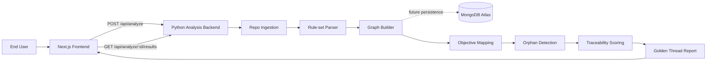

# github-compliance-engine

## Overview

GitHub Compliance Engine is a POC for analyzing public GitHub repositories and producing a Golden Thread traceability report. The current ingestion flow accepts a public repository URL, clones it, and extracts bounded repository metadata. Later features will build lexical graph documents, map interfaces to business objectives, flag orphaned code paths, and persist analysis results in MongoDB Atlas.

See the public Notion page for the [GitHub Compliance Engine Golden Thread reference](https://codingwizard-ai.notion.site/GitHub-Compliance-Engine-Code-to-Business-Alignment-Agentic-Workflow-Application-Golden-Thread-R-3cc94bf8d508810cac92dcb00c7816a4) to view how the Golden Thread Framework is used in action.

## Architecture



## Docker

This repository uses Docker Compose to orchestrate the local POC stack:

- `frontend`: Next.js app on `http://localhost:3000`
- `backend`: Python analysis API on `http://localhost:8000`

MongoDB Atlas is the planned external persistence platform. This feature does not require a database connection or run a local database container.

### Configure local environment

Create a local `.env` from the safe example values:

```sh
cp .env.example .env
```

The example file uses local-only placeholders:

```sh
NEXT_PUBLIC_BACKEND_BASE_URL=http://localhost:8000
FRONTEND_HOSTNAME=0.0.0.0
FRONTEND_PORT=3000
BACKEND_HOST=0.0.0.0
BACKEND_PORT=8000
BACKEND_CORS_ORIGINS=http://localhost:3000
INGESTION_WORKSPACE_ROOT=/tmp/github-compliance-engine/analyses
INGESTION_CLONE_DEPTH=1
INGESTION_CLONE_TIMEOUT_SECONDS=60
INGESTION_METADATA_TIMEOUT_SECONDS=30
INGESTION_FILE_TREE_MAX_DEPTH=20
INGESTION_FILE_TREE_MAX_FILES=5000
INGESTION_MAX_TEXT_FILE_BYTES=1048576
GITHUB_TOKEN=
GIT_PYTHON_GIT_EXECUTABLE=/usr/bin/git
```

Do not commit `.env`; it is ignored by git.

For one-off Docker commands, export the full local configuration in the same terminal before building or starting services:

```sh
export NEXT_PUBLIC_BACKEND_BASE_URL=http://localhost:8000
export FRONTEND_HOSTNAME=0.0.0.0
export FRONTEND_PORT=3000
export BACKEND_HOST=0.0.0.0
export BACKEND_PORT=8000
export BACKEND_CORS_ORIGINS=http://localhost:3000
export INGESTION_WORKSPACE_ROOT=/tmp/github-compliance-engine/analyses
export INGESTION_CLONE_DEPTH=1
export INGESTION_CLONE_TIMEOUT_SECONDS=60
export INGESTION_METADATA_TIMEOUT_SECONDS=30
export INGESTION_FILE_TREE_MAX_DEPTH=20
export INGESTION_FILE_TREE_MAX_FILES=5000
export INGESTION_MAX_TEXT_FILE_BYTES=1048576
export GITHUB_TOKEN=
export GIT_PYTHON_GIT_EXECUTABLE=/usr/bin/git
```

### Validate Compose

Check that the Compose file is structurally valid:

```sh
docker compose config
```

### Build Command

```sh
docker compose build
```

### Start the stack

Build and start the complete scaffold stack:

```sh
docker compose up --build
```

The frontend calls the backend through `http://localhost:8000`, matching the browser-visible API port.

`POST /api/analyze` validates the submitted URL, performs a shallow clone into `INGESTION_WORKSPACE_ROOT`, and synchronously extracts repository metadata. Extraction includes a root README, bounded file tree, language mix, supported manifests, and Express, FastAPI, Flask, or Spring hints. Clone and metadata work are controlled by the documented ingestion limits.

The GitHub Languages API is preferred for language byte counts. `GITHUB_TOKEN` is optional; when the API is unavailable, extraction records a safe warning and falls back to local file extensions. Results are attached to a process-local in-memory analysis record. MongoDB Atlas persistence is deferred to a later feature.

The backend image installs `git` and sets `GIT_PYTHON_GIT_EXECUTABLE=/usr/bin/git` so GitPython can initialize during container startup.

### Smoke test the acceptance path

With the stack running, open the frontend:

```sh
open http://localhost:3000
```

Submit:

```text
https://github.com/octocat/Hello-World
```

The scaffold should show an accepted analysis ID after the backend completes the shallow clone and metadata extraction. The public `202` response remains acceptance-oriented, and the results route still returns placeholder graph nodes and edges, objective mappings, orphaned code units, and a traceability score.

You can also call the backend directly:

```sh
curl -s -X POST http://localhost:8000/api/analyze \
  -H 'Content-Type: application/json' \
  -d '{"repo_url":"https://github.com/octocat/Hello-World"}'
```

Expected Golden Thread coverage for this scaffold is `FEAT-SCAFFOLD-001`, `TC-ING-001`, `TC-OBJ-001`, `TC-CORE-001`, `V-ING-001`, `V-OBJ-001`, and `V-CORE-001`.

Expected ingestion PR coverage is `FEAT-ING-001`, `FEAT-ING-002`, `BR-CORE-001`, `UR-USER-001`, `FR-ING-001`, `FR-ING-002`, `REST-ANALYZE-001`, `CF-ANALYZE-INGEST-001`, `TC-ING-001`, `TC-ING-002`, `V-ING-001`, and `V-ING-002`.

PR acceptance checks:

- `cd backend && .venv/bin/python -m pytest`
- `cd frontend && npm run lint`
- `cd frontend && npm run build`
- `docker compose config`
- Secret scan confirms `.env`, cloned repositories, Notion tokens, GitHub tokens, real Notion database IDs, and raw credentials are not committed.

### License review

Trivy may report LGPL-family license findings for indirect Next.js `sharp` optional platform packages in `frontend/package-lock.json`. This scaffold accepts those findings for the open-source repository; dependency replacement or scanner policy changes belong to release hardening.

Stop containers with:

```sh
docker compose down
```
