# github-compliance-engine

## Overview

GitHub Compliance Engine is a POC for analyzing public GitHub repositories and producing a Golden Thread traceability report. The system accepts a public repository URL, runs a Python analysis pipeline, builds a lexical graph in Neo4j, maps externally-facing interfaces to inferred business objectives, flags orphaned code paths, and returns a reviewable alignment score and report.


## Architecture

```mermaid
flowchart LR
  user[End User] --> frontend[Next.js Frontend]
  frontend -->|"POST /api/analyze"| backend[Python Analysis Backend]
  frontend -->|"GET /api/analyze/:id/results"| backend

  backend --> ingestion[Repo Ingestion]
  ingestion --> parser[Rule-set Parser]
  parser --> graphBuilder[Graph Builder]
  graphBuilder --> neo4j[(Neo4j Graph Store)]

  neo4j --> objective[Objective Mapping]
  objective --> orphan[Orphan Detection]
  orphan --> score[Traceability Scoring]
  score --> report[Golden Thread Report]
  report --> frontend
```



## Docker

This repository uses Docker Compose to orchestrate the local POC stack:

- `frontend`: Next.js app on `http://localhost:3000`
- `backend`: Python analysis API on `http://localhost:8000`
- `neo4j`: Neo4j browser on `http://localhost:7474` and Bolt on `bolt://localhost:7687`

### Configure local environment

Create a local `.env` from the safe example values:

```sh
cp .env.example .env
```

The example file uses local-only placeholders:

```sh
NEXT_PUBLIC_BACKEND_BASE_URL=http://localhost:8000
BACKEND_CORS_ORIGINS=http://localhost:3000
NEO4J_URI=bolt://neo4j:7687
NEO4J_USER=neo4j
NEO4J_PASSWORD=local-dev-password
```

Do not commit `.env`; it is ignored by git.

### Validate Compose

Check that the Compose file is structurally valid:

```sh
docker compose config
```

### Start the stack

After the `frontend/` and `backend/` scaffold commits are implemented, build and start the stack:

```sh
docker compose up --build
```

Stop containers with:

```sh
docker compose down
```

Remove the local Neo4j data volume when you need a clean graph store:

```sh
docker compose down -v
```
